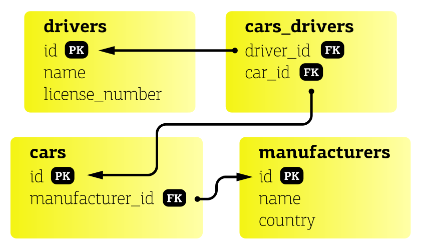

 
#Welcome to the taxi service!

I like this taxi driver,&nbsp&nbsp&nbsp&nbsp&nbsp&nbsp&nbsp&nbsp&nbsp&nbsp&nbsp&nbsp&nbsp&nbsp&nbsp&nbsp&nbsp 
racing through the dark streets 
of Tokyo&nbsp&nbsp&nbsp&nbsp&nbsp&nbsp&nbsp&nbsp&nbsp&nbsp 
as if life had no meaning.&nbsp&nbsp&nbsp&nbsp&nbsp&nbsp&nbsp&nbsp 
I feel the same way.&nbsp&nbsp&nbsp&nbsp&nbsp&nbsp&nbsp&nbsp&nbsp&nbsp&nbsp&nbsp&nbsp&nbsp&nbsp&nbsp 
<i><b>Richard Brautigan</b></i>

We love to take a joy taxi ride but to maintain the whole taxi service is not an 
easy task! Our little but so useful app is aimed to help manage this restless 
business and to keep all the things in one place.

####With its help upon login you can:

* Add a new car to database
* Specify the car by adding a manufacturer info
* Create a new driver account
* Display all the details about cars, manufacturers and drivers
* Define the drivers attached to the specific car and vice versa
* Delete items from database
* Be happy

###Implementation details

This project implements 3-tier architecture
* Controllers layer
* Service layer
* DAO layer

Also, the project utilizes a logger app for 
logging service information and a
special field injector to keep 
the Dependency Inversion Principle.

Service data is stored in MySQL tables. 
Relations between them are depicted here:

###Technologies used

* Java
* MySQL
* JDBC
* WebServlet
* WebFilter
* JSP
* JSTL
* HTML, CSS
* Maven
* Apache Tomcat

###Important notes on how to start

To start the app you need to have Apache Tomcat and MySQL 
installed and configured. An SQL schema is to be created using the
script found in resources/init_db.sql.  
To obtain access to MySQL DB you should edit "user" and "password" fields in
/util/ConnectionUtil.java to match your own.
In order logger to work properly please change "logs\app.log" in  
src/main/resources/log4j2.xml to the absolute path to your desired .log file.

####Then get into the yellow cab and enjoy the ride! Don't forget to fasten your seat belts!
 